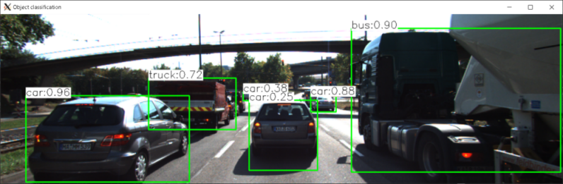
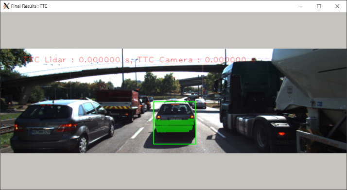
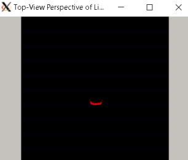
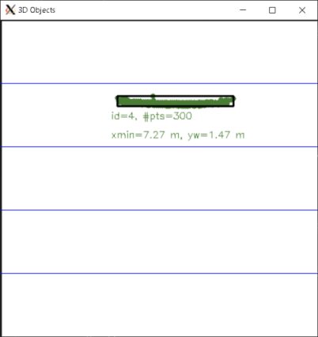
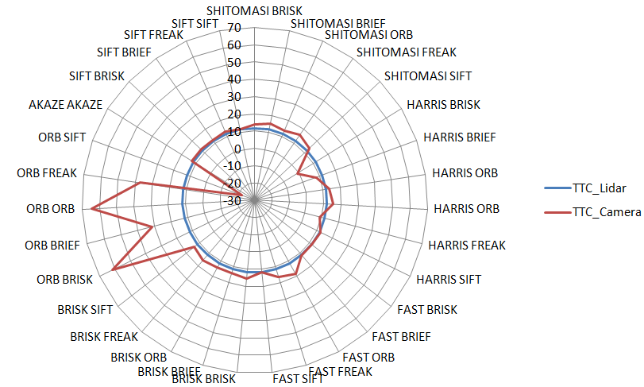

# Sensor Fusion Nanodegree

|Projects|
|---|
|[Lidar Obstacle Detection](https://github.com/ladrians/sfND_Lidar_Obstacle_Detection/blob/master/report.md)|
|[Camera Based 2D Feature Tracking](https://github.com/ladrians/sfND_2D_Feature_Tracking/blob/master/report.md)|
|[3D Object Tracking](https://github.com/ladrians/sfND_3D_Object_Tracking/blob/master/report.md)|
|[Radar Target Generation and Detection](https://github.com/ladrians/sfND_Radar_Target_Generation_and_Detection/README.md)|
|[Unscented Kalman Filter Highway](https://github.com/ladrians/sfND_Unscented_Kalman_Filter/blob/master/report.md)|

## 3D Object Tracking Project
Luciano Silveira
July, 2020

### Specification

Track an Object in 3D Space

The objective is to detect objects in an image using the YOLO deep-learning framework, associate regions in a camera image with Lidar points in 3D space and calculate the TTC (Time to Crash).

## Basic Build Instructions

1. Clone this repo.
2. Check [dependencies for running locally](https://github.com/udacity/SFND_3D_Object_Tracking#dependencies-for-running-locally).
3. Make a `build` directory in the top level project directory: `mkdir build && cd build`.
4. Download the [yolov3.weights](https://pjreddie.com/media/files/yolov3.weights) file to the `/dat/yolo/` folder.
5. Compile: `cmake .. && make`.
6. Run it: `./3D_object_tracking`.

### Match 3D Objects

Initially the YOLO deep-learning framework will classify the detections on the scene:

`FP.1` implements the method `matchBoundingBoxes`, which takes as input both the previous and the current data frames and provides as output the ids of the matched regions of interest (i.e. the boxID property); the matches are the ones with the highest number of keypoint correspondences.

Steps followed:

 * Create an internal int array `match_array` to accumulate the filtered points contained in both frames.
 * Get the maximum values for that matrix and assign the corresponding matches on the reference `bbBestMatches` variable.

### Compute Lidar-based TTC

`FP.2` computes the time-to-collision in second for all matched 3D objects using only Lidar measurements from the matched bounding boxes between current and previous frame. The initial code uses the reference from `03.02` section; a sample `Birds eye view` image:

Steps followed:

 * Find the closest distance to Lidar points for each frame, making sure the 3D point are within the ego lane.
 * Prevent division by zero.
 * Compute the time-to-collision (TTC) from both measurements.

### Associate Keypoint Correspondences with Bounding Boxes

`FP.3` prepares the TTC computation based on camera measurements by associating keypoint correspondences to the bounding boxes which enclose them. All matches which satisfy this condition are added to a vector in the respective bounding box.

Analyzing the correspondences between images, the detection ranges starting from [7.97m](./images/3d_object_detect01.png) to [6.81m](./images/3d_object_detect03.png); it makes sense as the images show that the vehicles are approaching a red semaphore so they are decelerating:

Notice that outlier matches have been removed based on the euclidean distance between them in relation to all the matches in the bounding box.

Based on section `06.04`:

 * Slightly adjust the size of the ROI so that the number of points which are not physically located on the object is reduced, taken a 10% `shrinkFactor` to avoid having too many outlier points around the edges.
 * Associate the resulting bounding box with the filtered matches.

### Compute Camera-based TTC

`FP.4` computes the time-to-collision in second for all matched 3D objects using only keypoint correspondences from the matched bounding boxes between current and previous frame.

Based on section `03.03`:

 * Compute the distance ratios between all matched keypoints using a `distRatios` vector.
 * Consider the minimum required distance; `10cm`.
 * Calculate the euclidean distance and ratios avoiding division by zero.
 * Calculate the median distance ratio to remove outlier influence.
 * Compute time-to-collision (TTC) based on the median.

### Performance

The algorithms were tested in different combinations and compared with regard to some performance measures.

The detailed execution between a combination of `descriptor` / `detector` can be checked and compared on the [report.csv](report.csv) file and resulting images with the pattern `descriptor_detector_imagenumber.png` saved on the [images](images) folder. The [report.xlsx](report.xlsx) file calculates average values and generates the associated graphs.

#### Evaluation 1

`FP.5` finds examples where the TTC estimate of the Lidar sensor does not seem plausible. From the previous section analysis, it is clear that the vehicles are approaching a red semaphore so the TTC (frames 01-18) must decrease because of desaceleration.

The following frames detail wrong measurement for Lidar TTC values, there was an increase in TTC Lidar calculation between consecutive frames (frames #3 and #17).

|Detector/Descriptor|Image #|Lidar TTC|
|---|---|---|
|SHITOMASI/BRISK|[0003](./images/SHITOMASI_BRISK_0003.png)|16.3845|
|SHITOMASI/BRIEF|[0003](./images/SHITOMASI_BRIEF_0003.png)|16.3845|
|SHITOMASI/ORB|[0003](./images/SHITOMASI_ORB_0003.png)|16.3845|
|AKAZE/AKAZE|[0017](./images/AKAZE_AKAZE_0017.png)|11.0301|
|SIFT/FREAK|[0017](./images/SIFT_FREAK_0017.png)|11.0301|

#### Evaluation 2

`FP.6` runs several `detector` / `descriptor` combinations implemented in previous chapters and compares with regard to the TTC estimate on a frame-by-frame basis. A resume on the execution can be checked on the [report.xlsx](report.xlsx) file; the average values can be sumarized on the following radar graph:

Lidar based computation shows that it is stable while camera-based TTC estimation is very bad in some combinations getting wrong values such as: negative values, `-INF` and `NAN`.

I would select the following combinations as best options because they are closer to the lidar TTC average measurements (which are more stable):

 * `SIFT/SIFT`, `SIFT/FREAK`
 * `FAST/BRIEF`, `FAST/BRISK`

### Links

 * [Original Repository](https://github.com/udacity/SFND_3D_Object_Tracking)
 * [Project Rubric](https://review.udacity.com/#!/rubrics/2550/view)

### Appendix

Detailed execution by `descriptor` / `detector` can be checked on the [images folder](./data/), some sample for image #0016 detailed below:

|Detector/Descriptor|Camera TTC|Lidar TTC|Image sample|
|---|---|---|---|
|SHITOMASI/BRISK|8.898673|10.845162|[sample #16](./images/SHITOMASI_BRISK_0016.png)|
|SHITOMASI/BRIEF|8.898673|11.795735|[sample #16](./images/SHITOMASI_BRIEF_0016.png)|
|SHITOMASI/ORB|8.898673|11.203624|[sample #16](./images/SHITOMASI_ORB_0016.png)|
|SHITOMASI/FREAK|8.898673|10.716109|[sample #16](./images/SHITOMASI_FREAK_0016.png)|
|SHITOMASI/SIFT|8.898673|10.210745|[sample #16](./images/SHITOMASI_SIFT_0016.png)|
|HARRIS/BRISK|8.898673|6.338662|[sample #16](./images/HARRIS_BRISK_0016.png)|
|HARRIS/BRIEF|8.898673|7.291746|[sample #16](./images/HARRIS_BRIEF_0016.png)|
|HARRIS/ORB|8.898673|6.603384|[sample #16](./images/HARRIS_ORB_0016.png)|
|HARRIS/FREAK|8.898673|6.457490|[sample #16](./images/HARRIS_FREAK_0016.png)|
|HARRIS/SIFT|8.898673|7.291746|[sample #16](./images/HARRIS_SIFT_0016.png)|
|FAST/BRISK|8.898673|11.487338|[sample #16](./images/FAST_BRISK_0016.png)|
|FAST/BRIEF|8.898673|11.218021|[sample #16](./images/FAST_BRIEF_0016.png)|
|FAST/ORB|8.898673|11.220639|[sample #16](./images/FAST_ORB_0016.png)|
|FAST/FREAK|8.898673|12.261320|[sample #16](./images/FAST_FREAK_0016.png)|
|FAST/SIFT|8.898673|11.214223|[sample #16](./images/FAST_SIFT_0016.png)|
|BRISK/BRISK|8.898673|10.804131|[sample #16](./images/BRISK_BRISK_0016.png)|
|BRISK/BRIEF|8.898673|9.468606|[sample #16](./images/BRISK_BRIEF_0016.png)|
|BRISK/ORB|8.898673|10.458415|[sample #16](./images/BRISK_ORB_0016.png)|
|BRISK/FREAK|8.898673|9.851232|[sample #16](./images/BRISK_FREAK_0016.png)|
|BRISK/SIFT|8.898673|10.956527|[sample #16](./images/BRISK_SIFT_0016.png)|
|ORB/BRISK|8.898673|9.760500|[sample #16](./images/ORB_BRISK_0016.png)|
|ORB/BRIEF|8.898673|12.709675|[sample #16](./images/ORB_BRIEF_0016.png)|
|ORB/ORB|8.898673|9.370819|[sample #16](./images/ORB_ORB_0016.png)|
|ORB/FREAK|8.898673|7.318464|[sample #16](./images/ORB_FREAK_0016.png)|
|ORB/SIFT|8.898673|8.345127|[sample #16](./images/ORB_SIFT_0016.png)|
|AKAZE/AKAZE|8.898673|9.101661|[sample #16](./images/AKAZE_AKAZE_0016.png)|
|SIFT/BRISK|8.898673|8.710034|[sample #16](./images/SIFT_BRISK_0016.png)|
|SIFT/BRIEF|8.898673|9.090199|[sample #16](./images/SIFT_BRIEF_0016.png)|
|SIFT/FREAK|8.898673|8.520908|[sample #16](./images/SIFT_FREAK_0016.png)|
|SIFT/SIFT|8.898673|8.944497|[sample #16](./images/SIFT_SIFT_0016.png)|
